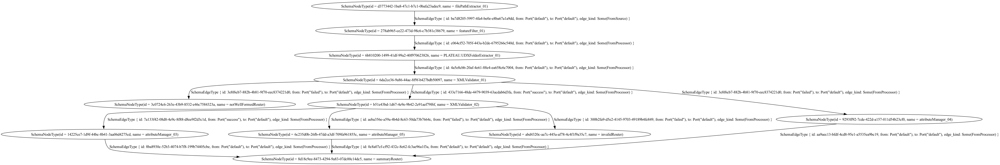

# Re:Earth Flow Engine

## Development

### Install toolchains

- Rust (stable)

### Install prerequisites

```console
cargo install cargo-make
cargo install cargo-watch
```

### Linux/Debian

On linux systems you'd need the development headers of libxml2 (e.g. `libxml2-dev` in Debian), as well as `pkg-config`.

### MacOS

```
$ brew install libxml2 pkg-config
$ echo $PKG_CONFIG_PATH
```

### Windows

- manually install builds tools c++ and english language by visiting [BuildTools](https://visualstudio.microsoft.com/fr/thank-you-downloading-visual-studio/?sku=BuildTools&rel=16)
- launch cmd prompt with admin privileges and execute these commands sequentially:

```
C:\> git clone https://github.com/microsoft/vcpkg
C:\> .\vcpkg\bootstrap-vcpkg.bat
C:\> setx /M PATH "%PATH%;c:\vcpkg" && setx VCPKGRS_DYNAMIC "1" /M
C:\> refreshenv
C:\> vcpkg install libxml2:x64-windows
C:\> vcpkg integrate install
```

### Python 3.11 and py2wasm (Optional)

This project requires `Python 3.11` and `py2wasm` for compiling Python scripts into WebAssembly (.wasm) files. If you want to use processors whose category is `WASM`, follow the steps below to install Python 3.11 and py2wasm on your operating system.

#### Linux/Debian

```
$ sudo apt update
$ sudo apt install python3.11 python3.11-distutils python3-pip
$ python -m pip install --upgrade pip
$ pip install py2wasm
```

#### MacOS

```
$ brew install python@3.11
$ python -m pip install --upgrade pip
$ pip install py2wasm
```

#### Windows

1. Download and install Python 3.11 from Python.org.
2. Ensure “Add Python to PATH” is selected during installation.

```
$ python -m pip install --upgrade pip
$ pip install py2wasm
```

## Input Variables

### Declaring an Input Variable

```yaml
# yaml-language-server: $schema=https://raw.githubusercontent.com/reearth/reearth-flow/main/engine/schema/workflow.json
id: 00caad2a-9f7d-4189-b479-153fa9ea36dc
name: "SimpleWorkflow"
entryGraphId: 3e3450c8-2344-4728-afa9-5fdb81eec33a
graphs:
  - id: 3e3450c8-2344-4728-afa9-5fdb81eec33a
    name: entry_point
    nodes:
      - id: 90f40a3e-61d3-48e2-a328-e7226c2ad1ae
        name: FeatureCreator
        type: action
        action: FeatureCreator
        with:
          creator: |
            [
              #{
                testAttribute: "test01"
              },
              #{
                testAttribute: "test02"
              },
            ]

      - id: d2b4977d-e218-4628-96f2-d26407aeea14
        name: attributeManager_01
        type: action
        action: AttributeManager
        with:
          operations:
            - attribute: addAttribute
              method: create
              value: |
                "createValue"

      - id: f5e66920-24c0-4c70-ae16-6be1ed3b906c
        name: Echo
        type: action
        action: EchoSink

    edges:
      - id: c064cf52-705f-443a-b2de-6795266c540d
        from: 90f40a3e-61d3-48e2-a328-e7226c2ad1ae
        to: d2b4977d-e218-4628-96f2-d26407aeea14
        fromPort: default
        toPort: default
      - id: c81ea200-9aa1-4522-9f72-10e8b9184cb7
        from: d2b4977d-e218-4628-96f2-d26407aeea14
        to: f5e66920-24c0-4c70-ae16-6be1ed3b906c
        fromPort: default
        toPort: default
```

### Variables on the Command Line

- To specify individual variables on the command line, use the -var option when running the

```console
$ cargo run --package reearth-flow-cli -- run --var="cityGmlPath=file:///root/53395658_bldg_6697_op.gml"
$ cargo run --package reearth-flow-cli -- run --var='cityGmlPath_list=["file:///root/53395658_bldg_6697_op.gml","file:///root/53395658_bldg_6698_op.gml"]' --var="addNsprefixToFeatureTypes=false"
$ cargo run --package reearth-flow-cli -- run --var='cityGmlPath_map={"path01":"file:///root/53395658_bldg_6697_op.gml","path02":"file:///root/53395658_bldg_6698_op.gml"}'
```

### Environment Variables

- As a fallback for the other ways of defining variables, Flow searches the environment of its own process for environment variables named FLOW*VAR* followed by the name of a declared variable.

```console
export FLOW_VAR_cityGmlPath="file:///root/53395658_bldg_6697_op.gml"
export FLOW_VAR_targetPackages='["bldg", "fld"]'
```

### Runtime Environment Variables

| Name                                          | Description                                                        | Default |
| --------------------------------------------- | ------------------------------------------------------------------ | ------- |
| FLOW_RUNTIME_ACTION_LOG_DISABLE               | Whether to disable the Action log                                  | false   |
| FLOW_RUNTIME_CHANNEL_BUFFER_SIZE              | Buffer size for channels exchanged by worker threads               | 256     |
| FLOW_RUNTIME_EVENT_HUB_CAPACITY               | Capacity size of event hub channels                                | 8192    |
| FLOW_RUNTIME_THREAD_POOL_SIZE                 | Worker thread pool size                                            | 30      |
| FLOW_RUNTIME_FEATURE_FLUSH_THRESHOLD          | Sink node flush threadshold size                                   | 512     |
| FLOW_RUNTIME_ASYNC_WORKER_NUM                 | Tokio Worker number                                                | cpu num |
| FLOW_RUNTIME_FEATURE_WRITER_DISABLE           | Whether to disable the ability to export data to the feature store | false   |
| FLOW_RUNTIME_SLOW_ACTION_THRESHOLD            | Threshold for writing slow action logs(ms)                         | 300     |
| FLOW_RUNTIME_WORKING_DIRECTORY                | working directory                                                  | macOS: `$HOME/Library/Caches/<project_path>`, Linux: `$HOME/.cache/<project_path>`, Windows: `%LOCALAPPDATA%\<project_path>` |
| FLOW_RUNTIME_NODE_STATUS_PROPAGATION_DELAY_MS | Delay (ms) to ensure node status events propagate                  | 500     |

## Intermediate Data & Cache

The workflow engine automatically captures intermediate data for debugging and analysis purposes.

### Cache Directory Location

By default, the engine stores intermediate data in the following locations:

- **macOS**: `$HOME/Library/Caches/reearth/flow/<project_key>/`
- **Linux**: `$HOME/.cache/reearth/flow/<project_key>/`
- **Windows**: `%LOCALAPPDATA%\reearth\flow\<project_key>\`

You can override this location by setting the `FLOW_RUNTIME_WORKING_DIRECTORY` environment variable.

### Directory Structure

```
<cache_directory>/
├── projects/<project_key>/
│   ├── jobs/<job_id>/
│   │   ├── feature-store/        # Feature data streams (JSONL format)
│   │   │   ├── <edge_id>.jsonl   # Features flowing through each edge
│   │   │   └── ...
│   │   ├── action-log/           # Action execution logs
│   │   └── temp/                 # Temporary files for this job
│   └── temp/<temp_id>/           # Project-level temporary files
```

### Accessing Intermediate Data

The intermediate feature data is stored in JSON Lines format and can be examined for debugging:

```bash
# View features flowing through a specific edge
cat <cache_directory>/projects/<project>/jobs/<job_id>/feature-store/<edge_id>.jsonl

# List available job data
ls <cache_directory>/projects/<project>/jobs/<job_id>/
```

### Configuration

- Set `FLOW_RUNTIME_FEATURE_WRITER_DISABLE=true` to disable intermediate data capture (not recommended for debugging)
- Adjust `FLOW_RUNTIME_FEATURE_FLUSH_THRESHOLD` to control buffering behavior (default: 512)

## Usage

### Run workflow

```console
$ cargo run --package reearth-flow-cli -- run --workflow ${workflow_path}
```

### Run example

See example [README](runtime/examples/README.md).

### Run generate graphviz

```console
$ brew install graphviz
$ cargo install yaml-include
$ export RUST_LOG=WARN
$ yaml-include examples/plateau/testdata/workflow/xml_validator.yml | cargo run --package reearth-flow-cli -- dot --workflow - | dot -Tpng > output.png
```



### Run generate action documentation

The properties of actions (e.g., name, description, parameters, etc.) are defined in JSON Schema files located at schema/actions*.json.
Whenever you add, update, or delete an action, make sure to update these schema files accordingly.
To do so, run the following command:

```console
$ cargo make doc-action
```
