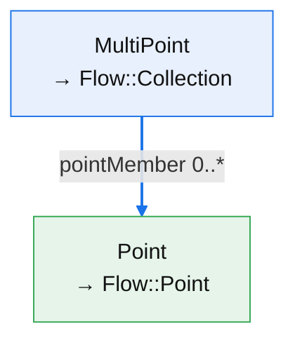
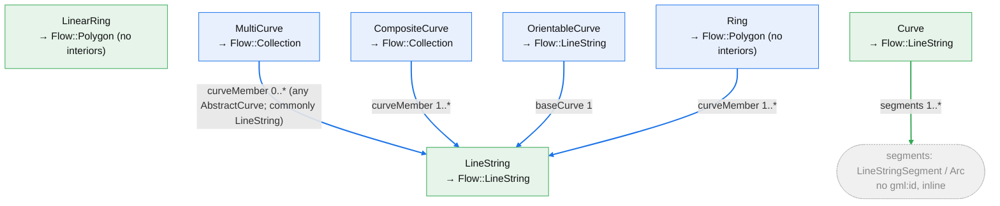
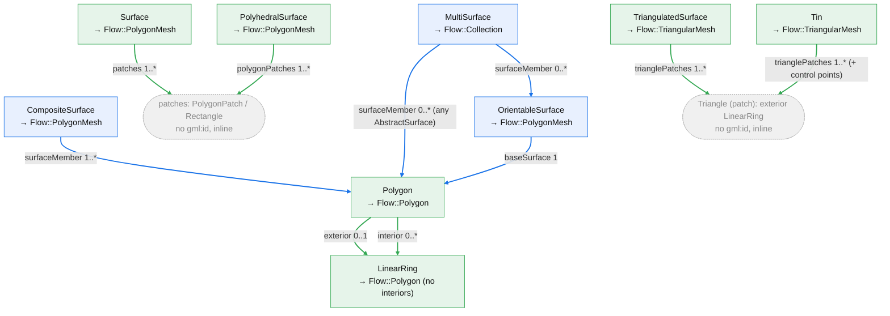
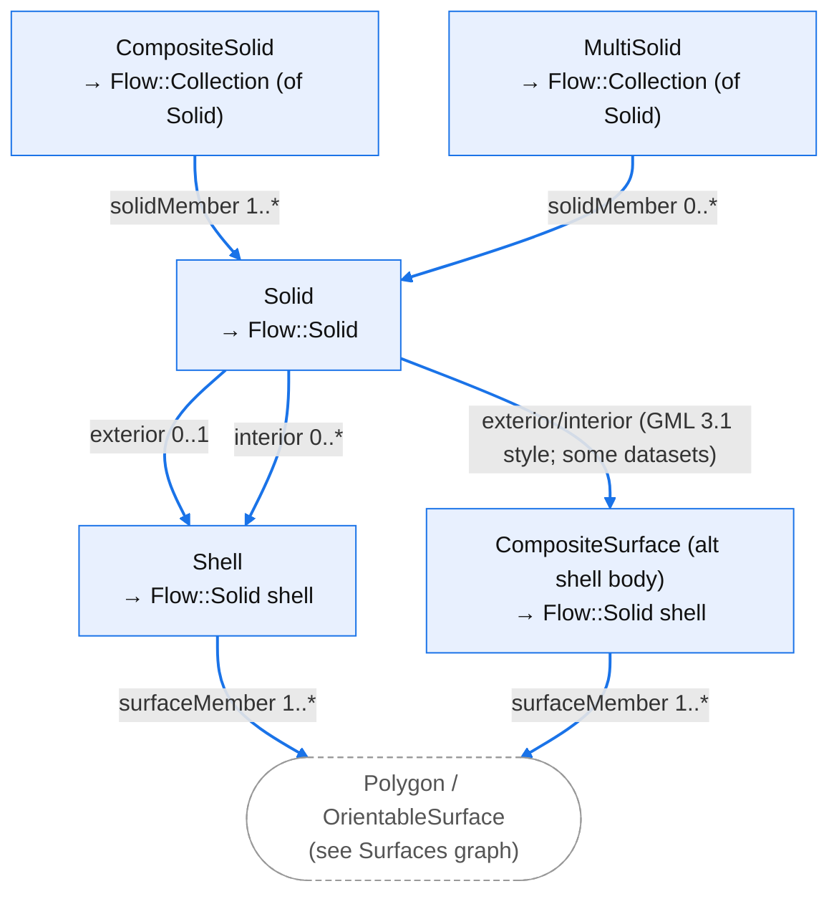
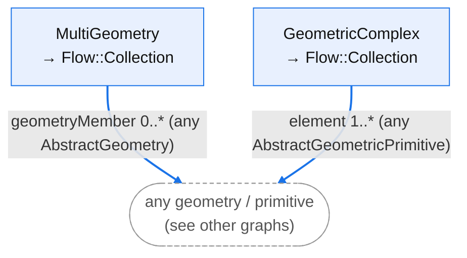
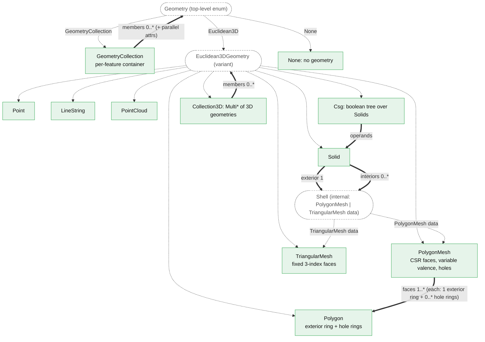

# GML geometry Mapping

This document is the reference for how GML geometry types map onto Flow's geometry
model (`reearth_flow_geometry`), and how the two passes of the reader work.

The geometry model is shared across GML 3.1 and GML 3.2. The geometry types, their
composition, and their `gml:id` / `xlink:href` behaviour are the same for every type
below. The type mapping and graphs therefore apply to all three CityGML versions.

## How it reads

The reader runs in two passes so it can resolve references that point forward or
across files:

1. **Streaming pass** (`process`, one call per file): the document is streamed and
   each geometry is examined. A geometry that is guaranteed to be fully self
   contained is parsed immediately into a Flow geometry. A geometry that can carry
   an `xlink:href`, or that contains one, is kept as a small unresolved node.
   Geometry is carved out of the feature's attribute tree at this point, so
   coordinate text is never retained as feature attributes. Every geometry that
   carries a `gml:id` is registered so it can be found by reference.
2. **Assembly pass** (`finish`, after all files): `xlink:href` and `gml:id`
   references are resolved (across files), unresolved container nodes are assembled
   from their resolved members, and each feature is emitted.

A feature's geometry is always a `GeometryCollection`, one member per geometry
property the feature carried. A CityGML feature can hold several
geometries at different levels of detail, and Flow's `Feature` has a single
geometry slot, so the collection is the container that holds them together.

When `extractTags` is set, boundary sub-features (for example `WallSurface`,
`RoofSurface`) are hoisted into their own features. Each carved geometry is
attached to the nearest enclosing feature that is actually emitted.

## The two geometry models as coupled type trees

The rest of this document describes two directed trees whose nodes are geometry
types and whose edges are the "can consist of" relation. The trees are coupled:
every CityGML node carries the Flow geometry type it becomes (`→ Flow::…`). That
projection is what the reader produces for a top-level geometry.

### Which CityGML types are nodes

A GML geometry type (3.1 or 3.2) is a node when it can carry a `gml:id`, i.e. it
derives from `gml:AbstractGML`. That is exactly the set of types that can be the
target of an `xlink:href`, and must therefore be individually registrable and
resolvable. In conformant GML 3.1 and 3.2 data every geometry object carries a
`gml:id`, so "can be a node" and "is a geometry object" describe the same set.

Types that derive from `AbstractSurfacePatch` / `AbstractCurveSegment` rather than
`AbstractGML` are never nodes. They cannot carry a `gml:id`, are never reference
targets, and are always parsed inline inside their owning object:

- Surface patches: `PolygonPatch`, `Triangle`, `Rectangle`
- Curve segments: `LineStringSegment`, `Arc`, and so on

`LinearRing` and `Ring` do derive from `AbstractGML`, so they are nodes. Flow has
no standalone ring type: a ring is a closed area boundary, so a standalone or
referenced ring becomes a `Flow::Polygon` with no interiors (its closed chain
becomes the single exterior ring). As a `Polygon`'s ring it is absorbed into that
`Polygon`.

### Inline vs reference-bearing

The graphs distinguish two kinds of type, which correspond to the two passes:

- **Inline** (green node the in graph): always fully self-contained, so it is parsed in
  the streaming pass. A type is inline when every one of its child properties is
  by-value only (no `xlink:href`) and every child type is itself inline.
  `TriangulatedSurface` is the clearest case: its only children are `Triangle`
  patches, which cannot be referenced, so it can be built end to end while
  streaming.
- **Reference-bearing** (blue node the in graph): may arrive by reference, or may contain a
  reference, so it is assembled in the second pass. In the edge coloring, a blue
  edge marks a property that can carry an `xlink:href`, or that points to a type
  that is not itself inline; a green edge marks by-value-only containment. Grey
  dotted nodes are the inline-only patches and segments that are not their own
  nodes.

## Graph 1: CityGML geometry composition (GML 3.1 / 3.2)

Split by dimensional family for legibility. Solid arrows `==>` are "can consist
of", labelled with the GML property and cardinality. Where a property formally
accepts a whole substitution group, edges go directly to the concrete types that
occur in practice, with the group named in the label.

### Points

### Curves and rings

### Surfaces

### Solids

`Solid`'s `exterior` / `interior` are by-value (`ShellPropertyType` has no
`xlink`), yet the edges are drawn as reference-bearing because the child `Shell` is
not itself inline (its `surfaceMember`s can be references).

### Heterogeneous aggregates (rare)

### Inline nodes

`Point`, `LineString`, `LinearRing`, `Polygon`, `Curve`, `Surface`,
`PolyhedralSurface`, `TriangulatedSurface`, and `Tin` are inline: the reader builds
them while streaming, with an eager constructor (`from_rings`, `from_polygons`,
`from_coords`, `from_soup`).

Every other type is reference-bearing and is assembled from its resolved members
in the second pass. These map to the Flow constructors that take members:
`Collection` (from the `Multi*` aggregates, `CompositeCurve` / `CompositeSolid`,
and `GeometricComplex`), `PolygonMesh` (`from_polygons`, welding a
`CompositeSurface`'s or `Shell`'s `surfaceMember`s into one surface), `Polygon`
(`from_rings` with an empty interior list, for a standalone or referenced ring),
and `Solid` (`from_exterior` over resolved shells).

## Graph 2: Flow geometry composition

Flow's model (the `reearth_flow_geometry` crate). Solid arrows `==>` are "can
consist of" with cardinality; dotted arrows `-.->` are enum-variant membership.
The `==>` edges are the member-taking constructors that the reference-bearing
CityGML types feed into.

The `faces → Polygon` edge is conceptual: a `PolygonMesh` face has the same ring
structure as a `Polygon` but is stored in the mesh's shared CSR buffers, not as
separate `Polygon` values.

## Coordinate order

GML `posList` / `pos` for the geographic CRSs used by CityGML are in
latitude, longitude, height order. The reader stores coordinates in `x, y, z`
order, so the leading latitude/longitude pair is swapped to `x = longitude`,
`y = latitude`. Reprojection to other CRSs happens in later workflow steps.

## Note on representation

Abstract substitution-group hubs are not drawn: aggregate members are almost
always `Polygon` in practice, so edges go directly to the concrete types that
occur, with the formal substitution group named in the edge label. The full set of
`gml:id`-bearing types is listed in the mapping table.
