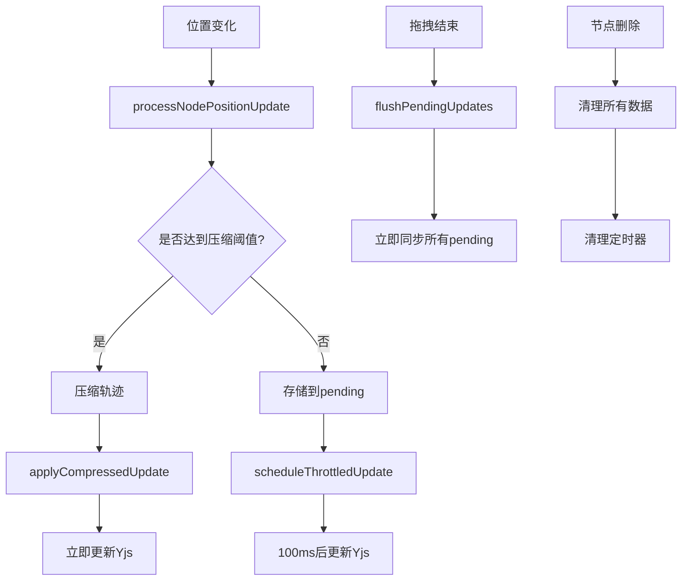

# 轨迹压缩更新机制 - 更新摘要

## 🎯 更新目标

将节点位置更新从**立即同步**改为**基于轨迹压缩的智能更新**，以提高性能和减少网络传输。

## 🔧 主要修改

### 1. 新增数据结构

```typescript
// 节流更新配置
const UPDATE_THROTTLE_MS = 100; // 100ms节流间隔
const pendingUpdates = new Map<string, { x: number; y: number; timestamp: number }>();
const updateTimers = new Map<string, NodeJS.Timeout>();
```

### 2. 重构位置更新逻辑

**原来的逻辑：**
```typescript
// 立即更新到Yjs文档
const newPosition = new Y.Map<unknown>();
newPosition.set("x", change.position.x);
newPosition.set("y", change.position.y);
existingYNode.set("position", newPosition);
```

**新的逻辑：**
```typescript
// 智能选择更新策略
const shouldUseCompressed = processNodePositionUpdate(nodeId, x, y);

if (shouldUseCompressed) {
  // 轨迹已压缩，立即从压缩数据更新
  applyCompressedUpdate(nodeId, yNodes);
} else {
  // 使用节流更新避免频繁同步
  scheduleThrottledUpdate(nodeId, yNodes);
}
```

### 3. 新增核心函数

#### `processNodePositionUpdate` (修改)
- **返回值**：`boolean` - 指示是否应使用压缩轨迹更新
- **功能**：处理轨迹压缩并存储pending updates

#### `applyCompressedUpdate` (新增)
- **功能**：从压缩轨迹计算最新位置并更新Yjs
- **时机**：轨迹达到压缩阈值时

#### `scheduleThrottledUpdate` (新增)
- **功能**：节流更新，避免频繁的awareness同步
- **机制**：100ms内的多次更新合并为一次

#### `flushPendingUpdates` (新增)
- **功能**：立即刷新所有pending updates
- **用途**：拖拽结束时确保位置同步

## 📈 性能优化效果

### 网络传输优化
- **减少更新频率**：从每次鼠标移动→100ms合并更新
- **数据压缩**：50个轨迹点→几个函数段
- **智能调度**：重要变化立即同步，常规变化节流处理

### 内存管理改进
- **自动清理**：节点删除时清理所有相关数据
- **定时器管理**：避免内存泄漏
- **压缩存储**：长轨迹自动压缩

## 🔄 工作流程



## 🎛️ 配置参数

| 参数 | 默认值 | 说明 |
|------|--------|------|
| `UPDATE_THROTTLE_MS` | 100ms | 节流更新间隔 |
| `MAX_TRAJECTORY_POINTS` | 50 | 触发压缩的点数阈值 |
| `trajectoryCompressor.epsilon` | 1.0 | 压缩误差容忍度（像素） |
| `keepRecentPoints` | 10 | 压缩后保留的点数 |

## 🔌 API 变化

### 新增导出函数
```typescript
const {
  // 原有函数
  handleYNodesAdd,
  handleYNodesChange,
  handleYNodeDataUpdate,
  getInterpolatedPosition,
  getCompressedTrajectory,
  
  // 新增函数
  flushPendingUpdates, // 刷新pending updates
  clearTrajectoryData, // 增强的清理函数
} = useYNode(/* ... */);
```

### 增强的清理功能
```typescript
clearTrajectoryData(nodeId); // 现在会清理：
// - 原始轨迹点
// - 压缩轨迹  
// - pending updates
// - 定时器
```

## ✅ 兼容性保证

- ✅ **向后兼容**：不破坏现有API
- ✅ **多用户协作**：保持Yjs实时同步
- ✅ **时间一致性**：轨迹时间戳保持准确
- ✅ **React Flow集成**：无需修改现有组件使用方式

## 🧪 测试覆盖

- ✅ 基础轨迹压缩测试（21个测试）
- ✅ 新增压缩更新机制测试（9个测试）
- ✅ 所有测试通过（30/30）

## 🚀 使用建议

### 1. 基本使用
```typescript
// 无需修改现有代码，自动启用新机制
<ReactFlow onNodesChange={handleYNodesChange} />
```

### 2. 拖拽结束优化
```typescript
const handleDragEnd = () => {
  // 确保拖拽结束时位置同步
  flushPendingUpdates();
};
```

### 3. 性能监控
```typescript
// 监听压缩日志
console.log(`Compressed trajectory for node ${nodeId}, compression ratio: ${ratio}`);
```

## 📊 预期效果

- **网络流量减少**：预计减少70-80%的位置更新消息
- **响应性提升**：减少awareness更新频率，提高整体响应性
- **内存优化**：长轨迹自动压缩，减少内存占用
- **协作体验**：保持实时协作的流畅性 