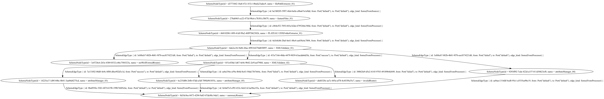

# Re:Earth Flow Worker

## Development

### Install toolchains
- Rust (stable)

### Install prerequisites

```console
cargo install cargo-make
cargo install cargo-watch
```

### Linux/Debian

On linux systems you'd need the development headers of libxml2 (e.g. `libxml2-dev` in Debian), as well as `pkg-config`.

### MacOS
```
$ brew install libxml2 pkg-config
$ echo $PKG_CONFIG_PATH
```

### Windows
* manually install builds tools c++ and english language by visiting [BuildTools](https://visualstudio.microsoft.com/fr/thank-you-downloading-visual-studio/?sku=BuildTools&rel=16)
* launch cmd prompt with admin privileges and execute these commands sequentially:

```
C:\> git clone https://github.com/microsoft/vcpkg
C:\> .\vcpkg\bootstrap-vcpkg.bat
C:\> setx /M PATH "%PATH%;c:\vcpkg" && setx VCPKGRS_DYNAMIC "1" /M
C:\> refreshenv
C:\> vcpkg install libxml2:x64-windows
C:\> vcpkg integrate install
```

## Input Variables
### Declaring an Input Variable
``` yaml
# yaml-language-server: $schema=https://raw.githubusercontent.com/reearth/reearth-flow/main/schema/workflow.json
id: a7fc8f35-b84f-496b-a2cb-65be3bfec285
name: "lod_splitter_with_dm"
entryGraphId: 3e3450c8-2344-4728-afa9-5fdb81eec33a
with:
  cityGmlPath:
  cityCode:
  codelistsPath:
  schemasPath:
  schemaJson: !include ../config/schema.txt
  targetPackages:
    - bldg
  addNsprefixToFeatureTypes: true
  extractDmGeometryAsXmlFragment: false
```

### Variables on the Command Line
* To specify individual variables on the command line, use the -var option when running the

``` console
$ cargo run -- run --var="cityGmlPath=file:///root/53395658_bldg_6697_op.gml"
$ cargo run -- run --var='cityGmlPath_list=["file:///root/53395658_bldg_6697_op.gml","file:///root/53395658_bldg_6698_op.gml"]' --var="addNsprefixToFeatureTypes=false"
$ cargo run -- run --var='cityGmlPath_map={"path01":"file:///root/53395658_bldg_6697_op.gml","path02":"file:///root/53395658_bldg_6698_op.gml"}'
```

### Environment Variables
* As a fallback for the other ways of defining variables, Flow searches the environment of its own process for environment variables named FLOW_VAR_ followed by the name of a declared variable.

```console
export FLOW_VAR_cityGmlPath="file:///root/53395658_bldg_6697_op.gml"
export FLOW_VAR_targetPackages='["bldg", "fld"]'
```

## Usage

### Run workflow
```console
$ cargo run -- run --workflow ${workflow_path}
```

### Run example
#### Run attribute_reader example
```console
$ FLOW_VAR_cityGmlPath="${target_citygml_path}"
$ FLOW_VAR_codelistsPath="${codelists_path}"
$ FLOW_VAR_schemasPath="${schemas_path}"
$ cargo run --package reearth-flow-examples --example attribute_reader
```

### Run generate graphviz
```console
$ brew install graphviz
$ cargo install yaml-include
$ yaml-include examples/plateau/testdata/workflow/xml_validator.yml | cargo run -- dot --workflow - | dot -Tpng > output.png
```



### Run generate action documentation
```console
$ cargo make doc-action
```
